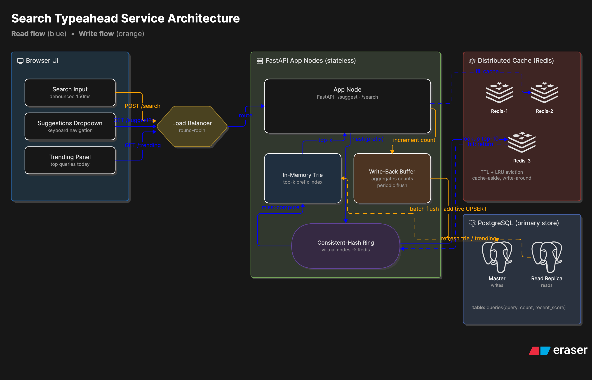
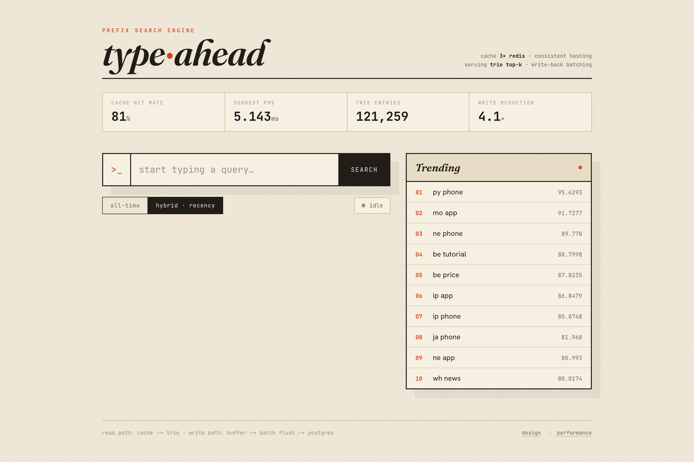
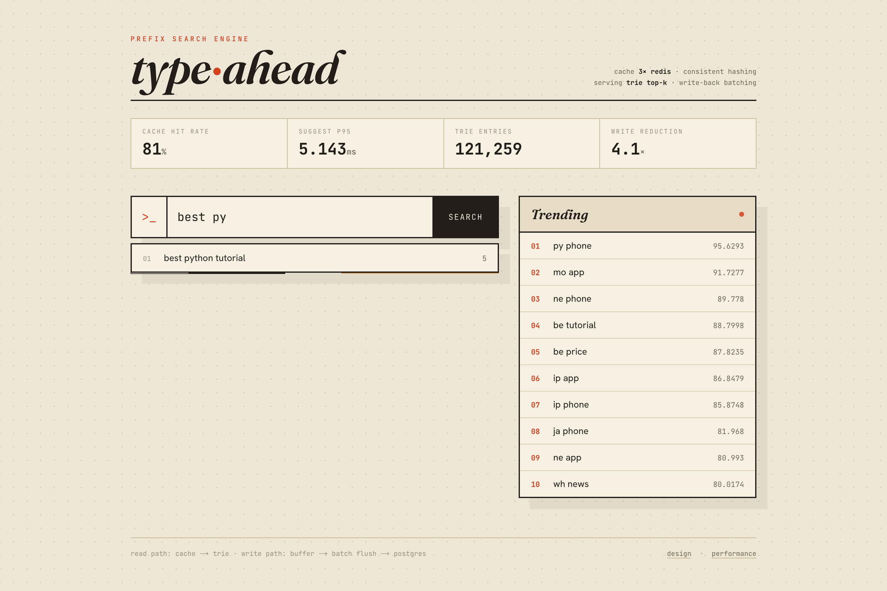
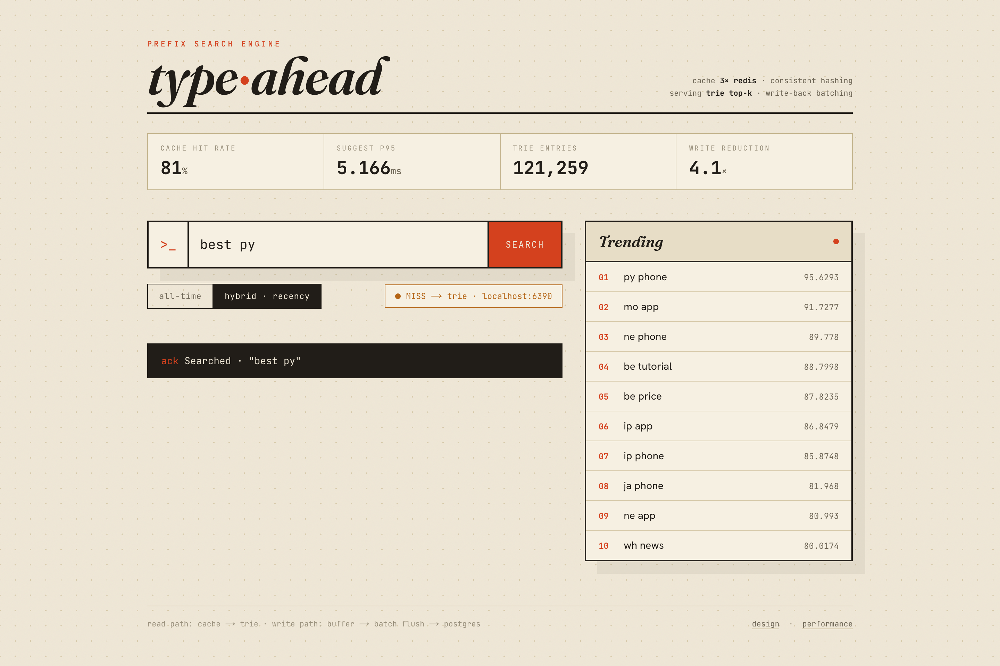

# Typeahead — Prefix Search Engine



A search-autocomplete service built as a learning rebuild on **Next.js**. It
suggests popular queries as you type, records what people submit, and serves
suggestions with low latency. Reads come from a **distributed cache** (3 Redis
nodes routed by consistent hashing) backed by an **in-memory trie**; writes are
**batched (write-back)** into PostgreSQL.

> This is an exploratory reimplementation of a classic typeahead system-design
> problem. The *architecture* is the point; the framework (Next.js App Router +
> TypeScript) is just the vehicle. If you want to understand how the whole thing
> fits together, read [understand.md](understand.md).

**Stack:** Next.js 15 (App Router, Route Handlers) · TypeScript · PostgreSQL ·
3× Redis · React UI.
Design decisions and trade-offs: [DESIGN.md](DESIGN.md). Measured numbers:
[PERFORMANCE.md](PERFORMANCE.md).

## Screenshots

| Overview + live gauges | Suggestions | Search ack + routing |
|---|---|---|
|  |  |  |

## Run

```bash
docker compose up -d                  # Postgres + 3 Redis
cp .env.example .env
npm install

npm run load -- --synthetic 120000    # quick start, no download
npm run build
npm start                             # next start -p 8000
open http://127.0.0.1:8000
```

For live development with hot reload, `npm run dev` works too — the server-side
runtime (trie, write buffer, Redis pool) is initialized once and reused across
reloads via a `globalThis` singleton (see [lib/runtime.ts](lib/runtime.ts)).

Postgres is on host port **5433** (5432 is often taken by a native install);
the Redis nodes are on **6390 / 6391 / 6392**.

## Dataset

AOL 2006 query log (real searches; counts derived by aggregation). To load it:

```bash
curl -L -o files/aol.zip "https://archive.org/download/AOL_search_data_leak_2006/AOL_search_data_leak_2006.zip"
unzip -o -j files/aol.zip "AOL-user-ct-collection/*.txt.gz" -d files/aol_data
npm run load -- --dir files/aol_data --min-count 2 --out files/aol_agg.tsv
npm run load -- --agg-file files/aol_agg.tsv --top 1000000 --min-count 3
```

35.4M rows → 4.1M distinct queries; we load the top 1M by count (the full set
makes the in-memory trie unnecessarily large). `--synthetic N` needs no download.

## API

All endpoints are Next.js Route Handlers under `app/api/`.

| Method | Endpoint | Description |
|---|---|---|
| GET | `/api/suggest?q=<prefix>&mode=count\|hybrid` | Top-10 prefix matches. `count` = all-time, `hybrid` = recency-aware. |
| POST | `/api/search` `{"query":"..."}` | Returns `{"message":"Searched"}`; buffers the count. |
| GET | `/api/cache/debug?prefix=<p>` | Which cache node owns the prefix + HIT/MISS. |
| GET | `/api/cache/ring?sample=N` | Key distribution across nodes. |
| GET | `/api/trending?n=10` | Trending by decayed recent score. |
| GET | `/api/metrics` | Hit rate, DB read/write counts, write reduction, p50/p95. |

```bash
npm run bench -- --reads 8000 --writes 20000    # performance report
```

## Layout

```
app/
  page.tsx              server shell (masthead, footer)
  layout.tsx            fonts + metadata
  globals.css           "paper terminal" theme
  api/                  suggest · search · trending · metrics · cache/debug · cache/ring
components/
  SearchConsole.tsx     the client UI (debounced suggest, keyboard nav, trending, gauges)
lib/
  runtime.ts            singleton bootstrap (trie + buffer + cache live here)
  config.ts  cache.ts  consistentHash.ts  trie.ts  store.ts
  writeBuffer.ts  ranking.ts  trending.ts  metrics.ts
scripts/
  loadDataset.ts  benchmark.ts
```
